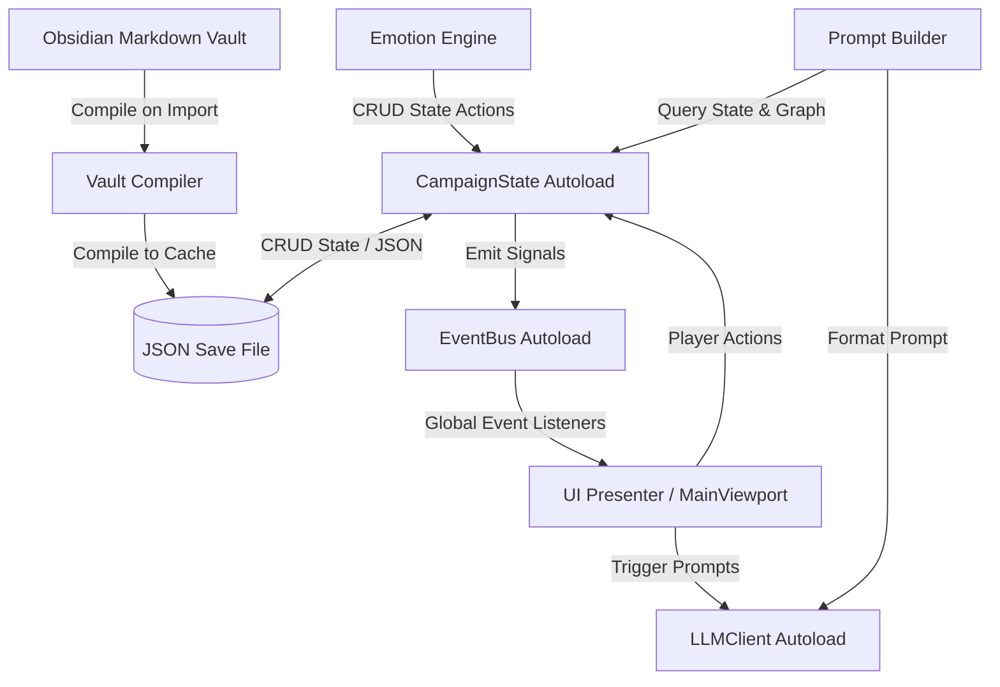
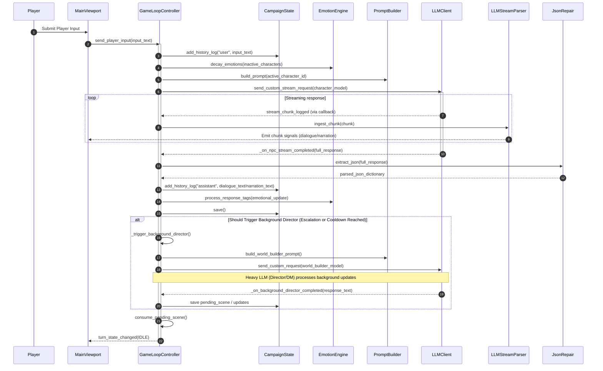
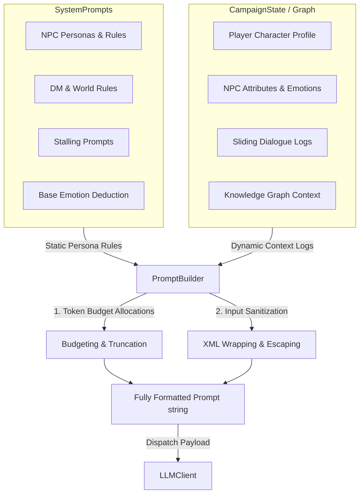

# Orison Architectural Layout

This document outlines the high-level architectural blocks, data flows, and subsystem relationships for the **Orison** game engine.

---

## 1. High-Level Block Diagram

The Orison runtime coordinates static author-defined vault files, a persistent local JSON save state document, local AI API clients, and the Godot presentation layer. The architecture utilizes a global Event Bus and Singletons to keep state, network client pools, and visual representations completely decoupled.

---

## 2. Core Subsystems

### 2.1 Vault Compiler & Parser (`res://src/core/`)
* **Responsibility:** Implements a read-only compilation pipeline. It scans the targeted Obsidian Markdown vault directory, extracts Frontmatter metadata, parses scene headers and choice links, and compiles them into a runtime JSON configuration file in the game's `user://` directory. It never writes back to the user's original vault.
* **Key Files:**
  * [VaultCompiler.gd](src/core/VaultCompiler.gd): Recursively scans directories and compiles character and scene files.
  * [MarkdownParser.gd](src/core/MarkdownParser.gd): Parses YAML Frontmatter, markdown tables, and choice links.
  * [PlayerInputParser.gd](src/core/PlayerInputParser.gd): Parses player inputs into dialogue and action/context segments based on visual novel formatting cues.

### 2.2 Story State Manager (`res://src/autoload/`)
* **Responsibility:** Manages the game world's dynamic variables, quest progress flags, character inventories, and choice pathways. It registers as a global Autoload singleton that writes dynamic state variables to the active campaign JSON save file.
* **Key Files:**
  * [CampaignState.gd](src/autoload/CampaignState.gd): Coordinates active campaign sessions, maintains state dictionaries, and saves files.
  * [SaveManager.gd](src/core/SaveManager.gd): Handles atomic file operations to read/write JSON files in `user://adventures/`.

### 2.3 Emotion Engine (`res://src/core/`)
* **Responsibility:** Parses conversational JSON response tags from the LLM to update character affinity values and append emotional event records to the active character's memory graph.
* **Key Files:**
  * [EmotionEngine.gd](src/core/EmotionEngine.gd): Processes response tags, scales updates based on NPC temperament, and writes logs.
  * [EmotionPromptBuilder.gd](src/core/EmotionPromptBuilder.gd): Injects character mood histories and affinity levels into the LLM system prompt.

### 2.4 Context Synthesizer & Prompt Assembly (`res://src/core/`)
* **Responsibility:** Aggregates runtime campaign state, queries the knowledge graph, calculates token budgets, and formats dynamic context blocks. It acts as the orchestrator of the prompt construction process.
* **Key Files:**
  * [PromptBuilder.gd](src/core/PromptBuilder.gd): Synthesizes prompts by combining static instructions with runtime logs, character histories, world states, and lore.
  * [KnowledgeGraphManager.gd](src/core/KnowledgeGraphManager.gd): Traverses nodes and edges in the JSON memory graph to identify contextual details.

### 2.5 Prompt Templates & AI Client (`res://src/autoload/` & `res://src/core/`)
* **Responsibility:** Defines all static instructions, persona rules, formatting constraints, and dispatches compiled requests to local model servers.
* **Key Files:**
  * [SystemPrompts.gd](src/core/SystemPrompts.gd): Serves as the central repository for static prompt templates, output JSON schemas, and persona definitions. It is strictly state-free and does not query CampaignState.
  * [LLMClient.gd](src/autoload/LLMClient.gd): Autoload handling connection handshakes and HTTP requests.
  * [LLMStreamRequest.gd](src/core/LLMStreamRequest.gd): Manages the low-level asynchronous HTTP client state polling and chunk dispatch.
  * [JsonRepair.gd](src/core/JsonRepair.gd): Cleans and extracts malformed JSON blocks from model outputs.

### 2.6 Image Generation Subsystem (`res://src/autoload/` & `res://src/core/`)
* **Responsibility:** Handles local text-to-image stable diffusion generation and procedural vector placeholder rendering for scenes, character avatars, and items.
* **Key Files:**
  * [ImageGenClient.gd](src/autoload/ImageGenClient.gd): Coordinates REST client HTTP calls to local Draw Things / A1111 APIs.
  * [ImageGenManager.gd](src/autoload/ImageGenManager.gd): Directs asset request queues, dimension configurations, and directory copying.
  * [ProceduralArtEngine.gd](src/core/ProceduralArtEngine.gd): Renders vector shape-based fallback backgrounds and character placeholder icons.

### 2.7 Decoupled Messaging (`res://src/autoload/`)
* **Responsibility:** Dispatches signals globally to prevent UI controls and core backend systems from referencing each other directly.
* **Key Files:**
  * [EventBus.gd](src/autoload/EventBus.gd): Switchboard declaring core game state changes and narrative updates.

### 2.8 Media & Audio Coordinator (`res://src/autoload/`)
* **Responsibility:** Orchestrates background music playback, locations crossfades, character voice clip spawning, and manages AI generator stubs (TTS, Stable Diffusion) with procedural fallbacks.
* **Key Files:**
  * [MediaManager.gd](src/autoload/MediaManager.gd): Coordinator autoload listening to EventBus location changes and speaking events to execute audio transitions.

### 2.9 UI Presenter & Onboarding (`res://src/ui/`, `res://src/autoload/` & `res://scenes/ui/`)
* **Responsibility:** Controls viewport rendering, dialogue text scrolls, character sprite updates, user configurations, and multi-stage campaign setup wizards.
* **Key Files:**
  * [MainViewport.tscn](scenes/ui/MainViewport.tscn): Responsive visual layout containing stage controls and narrative viewports.
  * [MainViewport.gd](src/ui/MainViewport.gd): Controller connecting button callbacks and listening to Event Bus signals.
  * [ResizablePanel.gd](src/ui/ResizablePanel.gd): Script enabling drag-to-resize operations on the chat panel container.
  * [CharacterVisuals.gd](src/ui/CharacterVisuals.gd): Animates sprite transitions, visual styles, floating emotional updates, and displays physical emotion reactions.
  * [ThemeManager.gd](src/autoload/ThemeManager.gd): Applies active styles, handles font size variations, and manages theme saving.
  * [OnboardingFlow.tscn](scenes/ui/OnboardingFlow.tscn): Multi-step onboarding sequence layout (import wizard, character generator, review panel).
  * [OnboardingFlow.gd](src/ui/OnboardingFlow.gd): Controls onboarding animations, LLM/generation config, folder scanner, and starting point selectors.

---

## 3. Local AI Orchestration & Turn Flow

Orison splits narrative coordination into a two-model asynchronous architecture (Director/Actor Split) orchestrated by the `GameLoopController`:

### 3.1 Turn Roles & Prompt Constraints
- **Character Agent (Actor - Fast LLM)**: Focuses strictly on the active conversation target. Embodying the character in the first-person for dialogue, but writing any environmental narration in the third-person. When players eavesdrop or observe from hiding, the Actor is unaware of them and generates spoken self-talk, mutterings, or dialogue with others out loud (rather than staying silent or breaking character). It is bound by prompt rules to always progress the scene and never stall.
- **World Builder (Director - Heavy LLM)**: Acts as the Dungeon Master / Narrator. Generates atmospheric setting changes, handles skill checks / D&D-style dice rolls, manages global plot states, and controls scene transitions. It coordinates with the Character Agent by running asynchronously in the background.

---

## 4. Prompt Construction Pipeline

To keep AI persona instructions separated from live runtime data, Orison enforces a strict division between static templates and dynamic assembly.

