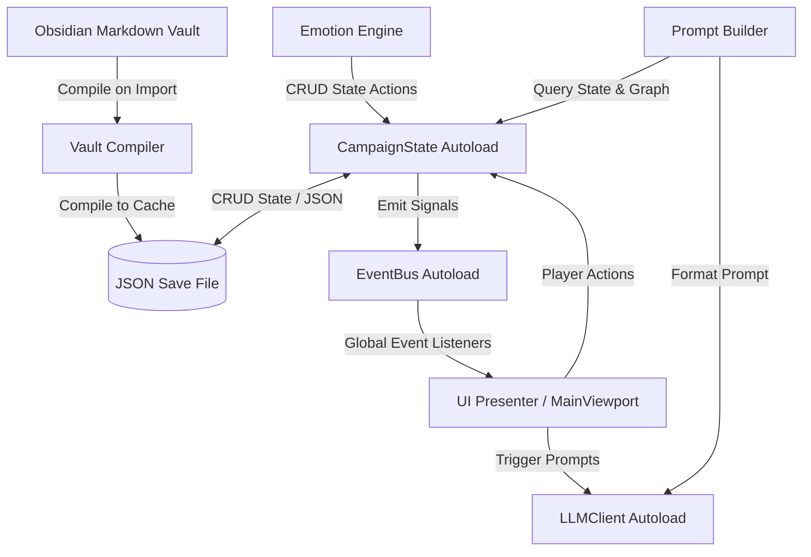

# Orison Architectural Layout

This document outlines the high-level architectural blocks, data flows, and subsystem relationships for the **Orison** game engine.

---

## 1. High-Level Block Diagram

The Orison runtime coordinates static author-defined vault files, a persistent local JSON save state document, local AI API clients, and the Godot presentation layer. The architecture utilizes a global Event Bus and Singletons to keep state, network client pools, and visual representations completely decoupled.

---

## 2. Core Subsystems

### 2.1 Vault Compiler & Parser (`res://src/core/`)
* **Responsibility:** Implements a read-only compilation pipeline. It scans the targeted Obsidian Markdown vault directory, extracts Frontmatter metadata, parses scene headers and choice links, and compiles them into a runtime JSON configuration file in the game's `user://` directory. It never writes back to the user's original vault.
* **Key Files:**
  * [VaultCompiler.gd](file:///Users/dylangrowcoot/Documents/Personal%20Apps/orison/src/core/VaultCompiler.gd): Recursively scans directories and compiles character and scene files.
  * [MarkdownParser.gd](file:///Users/dylangrowcoot/Documents/Personal%20Apps/orison/src/core/MarkdownParser.gd): Parses YAML Frontmatter, markdown tables, and choice links.

### 2.2 Story State Manager (`res://src/autoload/`)
* **Responsibility:** Manages the game world's dynamic variables, quest progress flags, character inventories, and choice pathways. It registers as a global Autoload singleton that writes dynamic state variables to the active campaign JSON save file.
* **Key Files:**
  * [CampaignState.gd](file:///Users/dylangrowcoot/Documents/Personal%20Apps/orison/src/autoload/CampaignState.gd): Coordinates active campaign sessions, maintains state dictionaries, and saves files.
  * [SaveManager.gd](file:///Users/dylangrowcoot/Documents/Personal%20Apps/orison/src/core/SaveManager.gd): Handles file operations to read/write JSON files in `user://adventures/`.

### 2.3 Emotion Engine (`res://src/core/`)
* **Responsibility:** Parses conversational JSON response tags from the LLM to update character affinity values and append emotional event records to the active character's memory graph.
* **Key Files:**
  * [EmotionEngine.gd](file:///Users/dylangrowcoot/Documents/Personal%20Apps/orison/src/core/EmotionEngine.gd): Processes response tags, scales updates based on NPC temperament, and writes logs.
  * [EmotionPromptBuilder.gd](file:///Users/dylangrowcoot/Documents/Personal%20Apps/orison/src/core/EmotionPromptBuilder.gd): Injects character mood histories and affinity levels into the LLM system prompt.

### 2.4 Context Synthesizer & prompt builders (`res://src/core/`)
* **Responsibility:** Builds the sliding context window for the LLM. It queries the active save file for character states, inventories, plot flags, and traverses the knowledge graph for semantic connections.
* **Key Files:**
  * [PromptBuilder.gd](file:///Users/dylangrowcoot/Documents/Personal%20Apps/orison/src/core/PromptBuilder.gd): Synthesizes prompts with recent logs, lore, and current state.
  * [KnowledgeGraphManager.gd](file:///Users/dylangrowcoot/Documents/Personal%20Apps/orison/src/core/KnowledgeGraphManager.gd): Traverses nodes and edges in the JSON memory graph to identify contextual details.

### 2.5 Local AI Client (`res://src/autoload/` & `res://src/core/`)
* **Responsibility:** Manages connection pools, HTTP payload formatting, response text retrieval, and regex-based response parsing/repaired JSON extraction for local inference endpoints (Ollama/llama.cpp).
* **Key Files:**
  * [LLMClient.gd](file:///Users/dylangrowcoot/Documents/Personal%20Apps/orison/src/autoload/LLMClient.gd): Autoload handling connection handshakes and HTTP requests.
  * [JsonRepair.gd](file:///Users/dylangrowcoot/Documents/Personal%20Apps/orison/src/core/JsonRepair.gd): Cleans and extracts malformed JSON blocks from model outputs.
  * [SystemPrompts.gd](file:///Users/dylangrowcoot/Documents/Personal%20Apps/orison/src/core/SystemPrompts.gd): Generates static system prompts for the two-model local setup.

### 2.6 Decoupled Messaging (`res://src/autoload/`)
* **Responsibility:** Dispatches signals globally to prevent UI controls and core backend systems from referencing each other directly.
* **Key Files:**
  * [EventBus.gd](file:///Users/dylangrowcoot/Documents/Personal%20Apps/orison/src/autoload/EventBus.gd): Switchboard declaring core game state changes and narrative updates.

### 2.7 UI Presenter (`res://src/ui/` & `res://scenes/ui/`)
* **Responsibility:** Controls viewport rendering, dialogue text scrolls, character sprite updates, and layouts. The UI nodes are laid out in visual scenes, binding elements dynamically via `@onready` properties.
* **Key Files:**
  * [MainViewport.tscn](file:///Users/dylangrowcoot/Documents/Personal%20Apps/orison/scenes/ui/MainViewport.tscn): Responsive visual layout containing stage controls and narrative viewports.
  * [MainViewport.gd](file:///Users/dylangrowcoot/Documents/Personal%20Apps/orison/src/ui/MainViewport.gd): Controller connecting button callbacks and listening to Event Bus signals.
  * [CharacterVisuals.gd](file:///Users/dylangrowcoot/Documents/Personal%20Apps/orison/src/ui/CharacterVisuals.gd): Animates sprite colors and spawns floating emotional event emojis.
