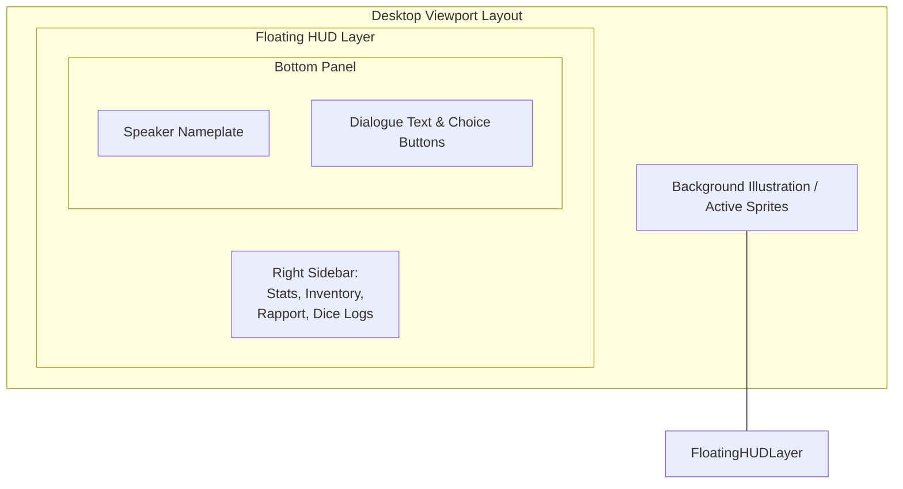

# Orison Design Philosophy & Language

This document establishes the official visual and interactive design system for **Orison** (Project Codex). It acts as the single source of truth for all frontend, user interface (UI), and motion-graphics development, ensuring a premium, unified experience across desktop (PC, Mac) and mobile (iOS, Android) platforms.

---

## 1. Core Visual Pillars

Orison's aesthetic is defined as **"The Ethereal Codex (Daybreak Edition)"**—a visual reflection of **the Dawn**, representing the incoming evolution of AI-generated stories. It merges the deep indigo twilight of the unformed story space, the aurora slate of semi-transparent canvas overlays, and the glowing solar-flare and dawn-rose accents of rising narrative paths, all framed by elegant, Apple-style digital interfaces (glassmorphic panels, clean layouts, and reactive glows).

```text
       ANALOG SOUL                                DIGITAL SHELL
[Parchment / Ink / Narrative]  <─── SEAMLESS ───>  [Glassmorphism / Glows / Grid]
```

### Pillar 1: Immersive Transparency
* **Contrast of Layers:** The background environment (loaded via [ImageGenManager](src/autoload/ImageGenManager.gd) as described in [ARCHITECTURE.md Section 2.6](ARCHITECTURE.md#26-image-generation-subsystem-resautoload-rescore)) is the visual focal point. The UI must never block it with solid, heavy shapes. Instead, use high-contrast glassmorphism—frosted panels with backdrop blurs and subtle edge borders—allowing the scene to bleed through the controls.
* **Non-Intrusive Overlays:** Controls float like cards over the canvas, casting soft dropshadows to establish depth.

### Pillar 2: Dynamic Tactility
* **Responsive Reactivity:** Every interactive element must feel alive. Buttons expand slightly on hover, sliders glide with easing, and dice rolls trigger physical-like UI responses.
* **Micro-animations over Static States:** Avoid sudden state changes. Interface shifts use short, organic transitions (tweening scales, opacity fades) that mimic organic physical movements.

### Pillar 3: Semantic Atmosphere
* **Aesthetics Linked to Logic:** Visual states reflect the backend data. Character cards pulse with soft hues corresponding to their active emotions (from [Emotion Engine](docs/emotions.md)), and the layout morphs dynamically to fit different screen dimensions without compromising layout density.

---

## 2. Color Palette & Emotional Mapping

To achieve a premium, dark-mode-first aesthetic reflecting the dawn, Orison uses a highly curated warm twilight-to-sunrise gradient HSL color palette.

### 2.1 Core Palette

| Token | Name | Color Value | Usage |
| :--- | :--- | :--- | :--- |
| `color-bg-base` | **Twilight Obsidian** | `HSL(260, 48%, 5%)` <br> `#0A0712` | Deep midnight/violet-indigo background representing the dark night before the dawn. |
| `color-surface` | **Aurora Slate** | `HSLA(250, 31%, 10%, 0.7)` <br> `#151224` (70% opacity) | Frosted dark violet-indigo surface that catches the first atmospheric glow. |
| `color-border` | **Sunrise Glow** | `HSLA(18, 80%, 90%, 0.08)` <br> `#FFF4EC` (8% opacity) | Peach-tinted frosty border representing the first beam of sunlight cutting through. |
| `color-text-primary` | **Sunbeam Silk** | `HSL(28, 100%, 97%)` <br> `#FFF8F2` | Warm cream-white primary reading text, dialogue, and title headings. |
| `color-text-secondary`| **Horizon Grey** | `HSL(252, 21%, 68%)` <br> `#A59EBF` | Soft lavender-grey secondary text for narration logs, metadata, etc. |
| `color-accent-focus` | **Solar Flare** | `HSL(11, 100%, 61%)` <br> `#FF5F38` | Primary focus states, choice button highlights, active selections. |
| `color-accent-success`| **Daybreak Meadow** | `HSL(160, 84%, 39%)` <br> `#10B981` | Positive rapport updates, confirmation dialogs, success events. |
| `color-accent-danger` | **Solstice Crimson** | `HSL(345, 84%, 55%)` <br> `#E11D48` | Negative rapport, critical health, exit buttons, hazard warnings. |

### 2.2 Emotional Glow Mapping

The [Emotion Engine](src/core/EmotionEngine.gd) (described in [ARCHITECTURE.md Section 2.3](ARCHITECTURE.md#23-emotion-engine-ressrccore)) drives character interactions. When rendering a character’s nameplate or their floating UI card, a subtle radial glow or panel border color is applied using the following mapping:

| Emotion | HSL / Hex | Visual Representation |
| :--- | :--- | :--- |
| **Serenity** | `HSL(220, 10%, 80%)` <br> `#D1D5DB` | Soft, neutral silver outline with steady, low-intensity pulse. |
| **Joy** | `HSL(45, 95%, 55%)` <br> `#F59E0B` | Warm golden-amber highlight, vibrant and radiant. |
| **Sadness** | `HSL(210, 85%, 60%)` <br> `#3B82F6` | Melancholic cobalt blue, dim and slow-pulsing. |
| **Anger** | `HSL(0, 75%, 50%)` <br> `#DC2626` | Sharp, high-intensity crimson border with rapid, aggressive pulse. |
| **Fear** | `HSL(280, 75%, 45%)` <br> `#7C3AED` | Flickering, unstable dark purple shadow. |
| **Trust** | `HSL(150, 70%, 40%)` <br> `#059669` | Warm emerald green, breathing slowly. |
| **Disgust** | `HSL(85, 75%, 40%)` <br> `#65A30D` | Toxic olive/acid-green tint, static and cold. |
| **Surprise** | `HSL(190, 90%, 50%)` <br> `#06B6D4` | Electric cyan/teal border, flashes rapidly upon activation. |

---

## 3. Typography & Text Hierarchy

We use a high-contrast font pairing to separate narrative immersion from analytical game statistics.

```text
	Dialogue (Serif: Lora / Merriweather)      |     Game Statistics (Sans-Serif: Outfit / Inter)
   "The old castle gates creak open..."        |     Inventory: [Staff of Light]  x1
```

### 3.1 Font Families
1. **Narrative Serif (Dialogue & Story Prose):**
   * *Selection:* **Lora** (or *Merriweather* / *Cinzel* as fallback).
   * *Purpose:* Instills a literary, fantasy-tabletop tone. Highly readable for long-form narrative dialogue.
2. **System Sans-Serif (Menus, Inventories, Roll Logs, UI Buttons):**
   * *Selection:* **Outfit** (or *Inter* / *Roboto* as fallback).
   * *Purpose:* Clean geometric structures with wide tracking for immediate scanning and data legibility.

### 3.2 Type Scale

| Element | Font Family | Size | Weight | Tracking (Letter Spacing) | Line Height |
| :--- | :--- | :--- | :--- | :--- | :--- |
| **Main Chapter Title** | Sans-Serif | `24px` | Semi-Bold (600) | `+0.05em` | `1.3` |
| **Speaker Nameplate** | Sans-Serif | `18px` | Bold (700) | `+0.1em` (ALL CAPS) | `1.2` |
| **Dialogue Text** | Serif | `18px` | Regular (400) | `Normal` | `1.6` |
| **Choice Button Text**| Sans-Serif | `14px` | Medium (500) | `+0.05em` | `1.2` |
| **Sidebar Widget Title**| Sans-Serif| `13px` | Semi-Bold (600) | `+0.08em` (ALL CAPS) | `1.3` |
| **Stat / Numeric Value**| Sans-Serif| `14px` | Regular (400) | `Normal` | `1.1` |
| **Micro Labels** | Sans-Serif | `11px` | Regular (400) | `+0.02em` | `1.2` |

---

## 4. Layout & Grid System (Responsive Viewports)

Orison adapts to both wide desktop screens and vertical mobile screens. It uses Godot's responsive container system (`MarginContainer`, `PanelContainer`, `HBoxContainer`, `VBoxContainer`).

### 4.1 Desktop (Horizontal Aspect Ratio: 16:9 / 16:10)

On desktop, the interface splits into a central story environment and a floating, collapsible RPG sidebar.



* **Environment Layer (Back):** Spans the entire 100% width and height of the window.
* **Dialogue Panel (Bottom Center):** 
  * Margins: `Left: 40px`, `Right: 40px`, `Bottom: 30px`.
  * Dimensions: Fixed height `200px`, maximum width `900px`.
  * Properties: Frosted glass panel with `12px` rounded corners and `15px` blur.
* **RPG Widget Sidebar (Right Float):**
  * Margins: `Top: 40px`, `Bottom: 40px`, `Right: 30px`.
  * Dimensions: Width `320px`. Collapsible via a minimal chevron button.
  * Contents: Rapport arcs, active inventory cards, and scrollable dice roll logs.

### 4.2 Mobile (Vertical Aspect Ratio: 9:16)

On mobile, widgets are stacked or hidden within a bottom sheet drawer system to maximize visibility.

```text
+-----------------------+
|  Active Character Art |
|                       |
|  [Show Stats Button]  |
+-----------------------+
|  [Speaker Name]       |
|  Frosted Dialogue Box |
|  with scrolling text  |
|                       |
|  - Choice Option 1    |
|  - Choice Option 2    |
+-----------------------+
```

* **Layout Adjustments:**
  * The Dialogue Box sits anchored to the bottom, taking up `35%` of the screen height.
  * Sidebars are completely removed. Stats, Inventory, and Logs are placed in a swipeable Bottom Sheet or drawer that rises over the screen when the "Show Stats" icon is tapped.
  * Choice buttons stack vertically rather than horizontally, filling the width of the dialogue box.

---

## 5. UI Components & Visual Tokens

### 5.1 The Dialogue Panel (`res://src/ui/MainViewport.gd`)

The Dialogue Panel is where players spend most of their time reading story text.

> [!NOTE]
> To simulate a cinematic experience, the dialogue box uses dynamic typing. A cursor indicator (`caret`) floats at the end of the text and pulses gently.

* **StyleBoxFlat Configuration (Godot):**
  * `Bg Color`: `HSLA(250, 31%, 10%, 0.75)`
  * `Border Width`: `Top/Left/Right/Bottom = 1px`
  * `Border Color`: `HSLA(18, 80%, 90%, 0.08)`
  * `Corner Radius`: `16px`
  * `Shadow Size`: `24px`
  * `Shadow Color`: `HSLA(0, 0%, 0%, 0.4)`

### 5.2 Choice Buttons (Narrative Branches)

Choice buttons appear when the story demands player input. They animate into view sequentially (cascading).

```text
Default State:
+───────────────────────────────────────────────────────+
| [ ] Focus Amethyst Indicator | Option text here       |
+───────────────────────────────────────────────────────+

Hover State:
+───────────────────────────────────────────────────────+
| [*] Glowing Amethyst Indicator | Option text here     | -> Scale 1.02x + Soft Border Glow
+───────────────────────────────────────────────────────+
```

* **Style Rules:**
  * **Default State:** Transparent background, white text, 1px frosted border.
  * **Hover State:** Background shifts to `HSLA(11, 100%, 61%, 0.15)`. Border shifts to solid Solar Flare (`#FF5F38`). Scale tweens up by `1.02x`.
  * **Pressed State:** Scale drops to `0.98x` for tactile feedback, background flashes to Solar Flare (`#FF5F38`) with `0.4` opacity.

### 5.3 The Rapport Meter (Affinity Indicator)

The Rapport Meter represents relationship values between `-1.0` (Nemesis) and `+1.0` (Best Friend). It is represented visually as a horizontal track.

```text
Nemesis [-1.0]                Acquaintance [0.0]               Best Friend [+1.0]
├───────────────████████████████───────┼───────────────────────────────┤
					  ▲
			   Active Position (e.g. -0.2 Enemy)
```

* **Visual Style:**
  * A track bar with `4px` height, using `color-border` as its background.
  * The filled region is a dual-color gradient:
	* Left side (Negative): Crimson (`#EF4444`)
	* Center (Neutral): Soft Slate (`#6B7280`)
	* Right side (Positive): Emerald (`#10B981`)
  * The indicator handle is a small `10px` glowing white circle that glides along the track when values change.

### 5.4 Dice Rolling & RPG Cards

Dice rolls are critical for D&D-style adventures. Rather than using raw text logs, rolls are rendered as frosted cards.

* **The Dice Card:**
  * A small square box (`80px` x `80px`) with rounded edges (`8px`).
  * When a roll occurs, the card shakes or spins (tweening rotation) before landing on the final number.
  * **Result Colors:**
	* *Natural 20:* Deep Emerald glow (`#10B981`) with golden particle burst.
	* *Natural 1:* Deep Crimson glow (`#EF4444`) with a jittery shake.
	* *Normal Success/Failure:* Standard Slate/Amethyst border depending on outcome.

---

## 6. Motion Language & Tweens

Animations must be smooth and performant, avoiding structural lag. All transitions use Godot's `Tween` system with specific transitions and easings.

### 6.1 Standard Tweens

| Animation Type | Target Property | Duration | Transition Type | Easing Type |
| :--- | :--- | :--- | :--- | :--- |
| **Dialogue Entry** | `modulate.a` (Opacity) | `0.2s` | `TRANS_QUAD` | `EASE_OUT` |
| **Panel Slide-in** | `position.y` / `position.x` | `0.35s` | `TRANS_CUBIC` | `EASE_OUT` |
| **Button Hover** | `scale` | `0.12s` | `TRANS_SINE` | `EASE_OUT` |
| **Character Sprite Fade** | `modulate.a` (Opacity) | `0.4s` | `TRANS_QUAD` | `EASE_IN_OUT` |
| **Character Sprite Move** | `position.x` | `0.5s` | `TRANS_CUBIC` | `EASE_OUT` |

### 6.2 Character Emotion Reactions (`res://src/ui/CharacterVisuals.gd`)

Characters react visually to dialogue changes. The [CharacterVisuals.gd](src/ui/CharacterVisuals.gd) script (described in [ARCHITECTURE.md Section 2.8](ARCHITECTURE.md#28-ui-presenter--onboarding-ressrui-resautoload-resscenesui)) translates emotion events into sprite adjustments:

* **Anger (Jitter Shake):**
  * Action: Rapidly offsets the sprite's `position.x` by random values between `-5px` and `5px` for `0.25 seconds`.
  * Shader: Modulates character texture to a subtle crimson hue.
* **Sadness (Dull Fade):**
  * Action: Tweens the sprite's `modulate` color towards `#9CA3AF` (dimming intensity) and lowers `position.y` by `15px`.
* **Joy/Surprise (Bounce Jump):**
  * Action: Tweens the sprite's `position.y` up by `30px` and back down using `TRANS_BOUNCE` and `EASE_OUT` over `0.4 seconds`.

---

## 7. Implementation Guidelines for Godot Developers

When writing UI scenes or editing code under `res://src/ui/`, developers must adhere to the following rules:

1. **Strict Theme Separation:** Never set ad-hoc colors, fonts, or margins inside node inspectors. Use a global theme file (`res://assets/themes/default_theme.tres`) containing standard StyleBoxes, Fonts, and Colors.
2. **Backdrop Blur Safety:** Godot's screen-reading shader (used for backdrop blurs) can be expensive on mobile. Always check the target platform; if mobile, automatically degrade the blur to simple semi-transparent backgrounds without screen copies to protect battery life.
3. **Save State Integrity:** Ensure UI changes never occur before save states are flushed. Visual notifications (e.g., "Rapport Increased!") should only trigger *after* the [SaveManager](src/core/SaveManager.gd) (described in [ARCHITECTURE.md Section 2.2](ARCHITECTURE.md#22-story-state-manager-resautoload)) returns a successful write code.
4. **Anchor Management:** Always use anchor presets (`Control -> Anchors Preset`) to anchor panels, ensuring layouts don't break when switching window ratios.

---

## 8. Integration & Document Alignment

* This design language dictates the visual presentation layer overseen by the **UI Presenter** specified in [ARCHITECTURE.md Section 2.8](ARCHITECTURE.md#28-ui-presenter--onboarding-ressrui-resautoload-resscenesui).
* All tickets regarding UI, including [TKT001 (Implement Responsive Full-Screen Dialogue UI)](docs/backlog.md#L9-L30), must use this document as their visual and interactive benchmark.
* New visual elements or animations should follow the module responsibilities described in [AGENTS.md](AGENTS.md), which is the canonical guide to where style logic lives.

---

## 9. Dynamic Theme Customization System

Orison provides a built-in **Visual Settings** menu that exposes five core color tokens. Users can modify these colors at runtime to customize the application's appearance, save their configurations as named themes, and select or delete custom themes.

### 9.1 Core Color Config Tokens
- **Canvas Background (`color_bg`)**: The underlying window viewport canvas backdrop.
- **Panel Surface (`color_surface`)**: The frosted container panels, cards, and list item backgrounds.
- **Horizon Border (`color_border`)**: Subtle glassmorphic outlines and progress bar backdrops.
- **Text Color (`color_text`)**: Main font colors for buttons, labels, and rich text displays.
- **Focus Accent (`color_accent`)**: Focus rings, button highlights, progress bar fills, and nameplate highlights.

### 9.2 Technical Implementation (`res://src/autoload/ThemeManager.gd`)
- Themes are loaded and saved under the dedicated theme configuration file (`user://theme_config.json`).
- When colors are modified, a duplicate copy of the global stylesheet resource is created (`Theme.duplicate(true)`), updated dynamically in memory, and applied to root controls.
- Screens and UI elements connect to `ThemeManager.theme_changed` to update custom node properties (e.g. ColorRect values) reactively.
