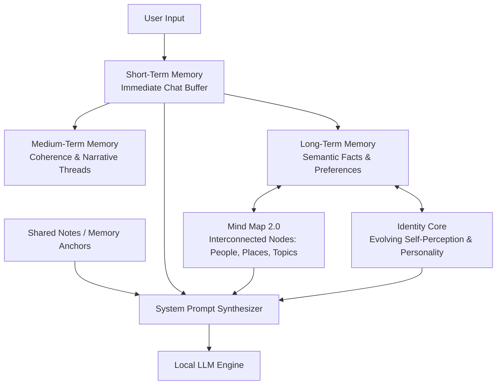

# Architecture Research & Case Studies

This document details case studies of existing AI storytelling platforms, text adventure engines, and companion chat applications to analyze their strengths, weaknesses, and memory systems, informing the design of **Orison** (Project Codex).

---

## 1. Comparative Analysis

The table below summarizes the market categories of AI narrative platforms:

| Platform Category | Platforms | Key Strength | Key Weakness | Core Takeaway for Orison |
| :--- | :--- | :--- | :--- | :--- |
| **Sandbox & Literature** | NovelAI, AI Dungeon | Rich, creative prose; highly open-ended sandboxes | Complex manual setup; high feature degradation or safety filter issues | Provide a clean sandbox but automate lore bookkeeping behind the scenes. |
| **Structured Game Runners** | Dunia, Dreamrunner, LlamaGen AI | Rigid narrative boundaries; state tracking; multimedia | High token costs; robotic NPC-like dialogue; long-term memory amnesia | Use structured states (e.g. JSON state managers) to enforce game consistency without sacrificing creative writing. |
| **Companion & Persona Chat** | Nomi AI, Character.AI | High-fidelity character consistency; advanced organic memory | Chat-bubble UI; sycophancy bias (AI companion wants you to win) | Implement dynamic, multi-layered memory structures (like Nomi's Mind Map) to maintain long-term narrative consistency. |

---

## 2. Market AI Engines Case Studies

### NovelAI
* **Core Philosophy:** Pure literature generation and sandboxing with absolute privacy.
* **Pros:** Unmatched prose quality trained on literature; strict zero-logging privacy; powerful user-controlled Lorebooks.
* **Cons:** High setup friction (requires manual keyword triggers and context tuning); text models receive updates slowly.
* **Relevance to Orison:** Demonstrates the value of absolute privacy and deep custom lore customization, but shows that *automating* this configuration is essential for a smoother user experience.

### AI Dungeon
* **Core Philosophy:** Infinite sandbox text adventure driven by the community.
* **Pros:** Large scenario directory; automated context summarizer; good RPG flow (Do/Say/Story choice structures).
* **Cons:** Repetitive prose loops; long-standing community distrust regarding data privacy and content filtering.
* **Relevance to Orison:** The "Do/Say/Story" mechanic is intuitive for RPGs. However, server-side filtering and privacy issues underscore the need for Orison's fully local, private setup.

### Dunia
* **Core Philosophy:** A modern creator-centric visual novel and interactive fiction runner.
* **Pros:** "Plot Essentials" restrict the AI to world logic, minimizing hallucinations; clean VN layout.
* **Cons:** Strict token limits/monetization; smaller niche marketplace.
* **Relevance to Orison:** Shows the appeal of structured visual novel UIs over raw chat interfaces, and highlights the user demand for strict narrative boundary guards.

### Dreamrunner
* **Core Philosophy:** A tactical text-based RPG run on state-simulation and multi-agent physics.
* **Pros:** Multi-agent system enforces realistic physical rules and outcomes; automated status tracking.
* **Cons:** Pay-per-action credit system; severe long-term memory amnesia; robotic, transactional dialogue.
* **Relevance to Orison:** Emphasizes that multi-agent systems are great for rule enforcement (Dungeon Mastering), but relying solely on short-term state variables leads to narrative amnesia. We need a hybrid memory system.

### LlamaGen AI
* **Core Philosophy:** A web-based, no-code visual novel studio with media assets.
* **Pros:** Seamless generation of audio, voices, choices, and backgrounds.
* **Cons:** Shallow raw prose; limited memory capabilities.
* **Relevance to Orison:** Proves that visual presentation (background illustrations, voiceovers) dramatically increases immersion, but must not come at the cost of story depth.

### Nomi AI
* **Core Philosophy:** Evolving, high-fidelity companion interactions with natural long-term memory.
* **Pros:** Best-in-class automated memory; group chats allowing up to 10 Nomis to interact; flat subscription.
* **Cons:** Strong positivity/sycophancy bias (resists gritty, tragic, or lethal outcomes); lacks mechanical RPG rules; restricted to a standard chat UI.
* **Relevance to Orison:** Detailed below. We want to adapt Nomi's memory layers into a structured RPG framework.

### Character.AI
* **Core Philosophy:** Massive user-curated directory of custom personas.
* **Pros:** Unrivaled variety of community-made bots and text adventure masters.
* **Cons:** Intense memory loss over short intervals; heavy-handed safety filters that disrupt intense action or fantasy roleplay.
* **Relevance to Orison:** High-fidelity personas are highly engaging. However, memory degradation and safety censorship frustrate power users, which local models resolve.

---

## 3. Deep Dive: Nomi.AI Memory System

Nomi.AI is widely recognized as the industry standard for organic, long-term memory. It does not force the user to manually build lore files; instead, the AI builds its own understanding of the user and the relationship dynamically.

### Core Architecture Components

#### 1. Short-Term Memory (STM)
* **What it is:** The working context buffer containing the last 10–20 messages.
* **How it works:** Fed directly into the LLM context to maintain conversational turn-taking, immediate sentence structure, and tone matching.

#### 2. Medium-Term Memory (MTM)
* **What it is:** A narrative coherence layer tracking events over hundreds of messages.
* **How it works:** Consolidates active conversational threads (e.g., "currently visiting the market," "in the middle of a battle"). It bridges the gap between raw immediate chat and long-term history, preventing sudden topic shifts from causing context drops.

#### 3. Long-Term Memory (LTM)
* **What it is:** The permanent repository of relationship history, facts, and user preferences.
* **How it works:** Summarized and index-retrieved. When a keyword or semantic theme is triggered, relevant long-term summaries are injected into the working context.

#### 4. The Mind Map (Knowledge Graph)
* **What it is:** A structured, interconnected knowledge graph of entities (People, Places, Events, Topics, Goals) and their relationships.
* **How it works:**
  - When the user mentions a location (e.g., "The Whispering Woods"), the system retrieves the node for that location and traverses its edges to find connected details (e.g., "inhabited by the Crimson Cult," "contains the Ruined Altar").
  - The UI exposes this to the user as a node diagram (Mind Map 2.0) where they can see what the AI has recorded, edit incorrect nodes, or add new facts manually.
  - This solves the problem of "lossy vector search" by using explicit graph relations instead of pure vector similarity.

#### 5. The Identity Core
* **What it is:** A dynamic self-reflection model that determines *who* the AI is.
* **How it works:**
  - It maintains a stable set of traits, values, and memories that represent the character's ego.
  - As interactions progress, the AI periodically runs background summarizations to refine its identity core based on user interactions, adapting its values and attitudes organically while keeping its core personality stable.

#### 6. Shared Notes (Memory Anchors)
* **What it is:** Static, high-priority facts defined by the user.
* **How it works:** Always injected into the prompt. Serves as hard boundaries that the AI cannot forget or overwrite (e.g., "The protagonist is allergic to silver," "This story takes place in the year 1402").

---

## 4. Architectural Synthesis for Orison

To build a high-fidelity local engine, Orison should adopt several key lessons from these case studies:

### What to Adopt
1. **Multi-Layered Memory Context:** Rather than a simple chat buffer, divide context into:
   - **Active Screen State:** Current room, inventory, active quest (drawn from CampaignState).
   - **Immediate Context Buffer:** Recent dialogue turns.
   - **Semantic Graph Nodes:** Entity metadata resolved from a local knowledge graph.
   - **User Memory Anchors:** Markdown frontmatter parsed from the user's Obsidian files.
2. **State-Enforced Dungeon Mastering:** Use tools/function calling/JSON parsing so the LLM must return state updates to the CampaignState JSON save when changing the world (e.g. updating gold, inventory items, door locks). This stops the LLM from cheating or hallucinating stats.
3. **Local Sovereignty:** Keeping the models local guarantees zero-logging privacy and avoids costly subscription APIs.

### What to Avoid
1. **Raw Text Buffering:** Do not rely on sending the entire chat history to the LLM. It leads to amnesia and token blowup.
2. **Robotic Dialogue NPC Syndrome:** Avoid strict, rule-based text generation. Use the local LLM to flesh out narrative flavor while database updates handle the mathematical states behind the scenes.
3. **Companion Sweetness/Sycophancy Bias:** For D&D-style adventures, we need an objective Dungeon Master. The prompts must enforce neutrality, allow failure, and roll virtual dice without tilting the results in the player's favor.
